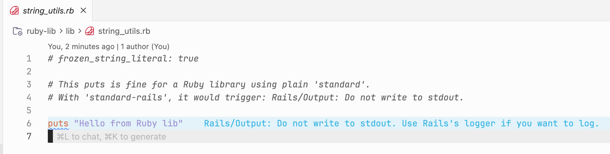

# Multi-Root Workspace Test Fixture

This fixture demonstrates and tests multi-root workspace support for the Standard Ruby extension.

## The Problem This Solves

Without multi-root support, the extension uses the **first** workspace folder's Standard Ruby configuration for **all** files. This causes false positives when different folders have different configurations.

In this example:
- `app-rails/` uses `standard-rails` (which includes Rails-specific cops like `Rails/Output`)
- `ruby-lib/` uses plain `standard` (no Rails cops)

The Rails folder is named `app-rails` so it comes first alphabetically. This is important because without multi-root support, the **first** folder's config is used for all files.

## How to Test

### Setup

Install dependencies in both folders:

```bash
cd test-fixtures/multi-root-demo
cd app-rails && bundle install
cd ../ruby-lib && bundle install
```

### Step 1: See the Bug (Published Extension)

First, verify the bug exists with the current published extension:

1. Open this workspace in VS Code (not Extension Development Host):
   - File > Open Workspace from File...
   - Select `test-fixtures/multi-root-demo/multi-root-demo.code-workspace`

2. Open `ruby-lib/lib/string_utils.rb`

3. You should see `Rails/Output: Do not write to stdout` errors on the `puts` statement - this is the bug. The Rails config from `app-rails` is being incorrectly applied to `ruby-lib`.



### Step 2: Verify the Fix (Extension Development Host)

Now verify the fix works:

1. Open the vscode-standard-ruby project in VS Code
2. Press F5 to launch the Extension Development Host
3. In the Extension Development Host, open this workspace:
   - File > Open Workspace from File...
   - Select `test-fixtures/multi-root-demo/multi-root-demo.code-workspace`

4. Check the Output panel (View > Output > Standard Ruby):
   - You should see TWO language servers starting:
     ```
     Starting language server for "app-rails": ...
     Starting language server for "ruby-lib": ...
     ```

5. Open `ruby-lib/lib/string_utils.rb`:
   - The `puts` statement should have NO errors
   - Each folder now gets its own language server with its own config

### Optional: Test Folder Add/Remove

- Remove one folder from the workspace
- Verify its language server stops in the Output panel
- Add it back
- Verify its language server restarts

## File Structure

```
multi-root-demo/
├── multi-root-demo.code-workspace   # VS Code workspace file
├── README.md                         # This file
├── app-rails/
│   ├── .standard.yml                 # Uses standard-rails plugin
│   ├── Gemfile
│   └── app/controllers/users_controller.rb
└── ruby-lib/
    ├── .standard.yml                 # Plain standard (no Rails)
    ├── Gemfile
    └── lib/string_utils.rb           # Has puts statement (valid for a lib)
```

## Note on File Location

The test file must be in `lib/`, `app/`, `config/`, or `db/` for the `Rails/Output` cop to check it. Files in other directories (like `bin/`) are not checked by this cop, so you won't be able to reproduce the issue there.
